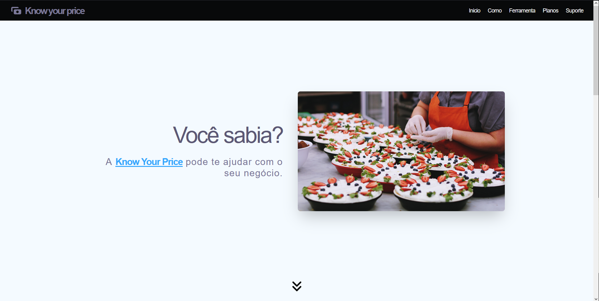
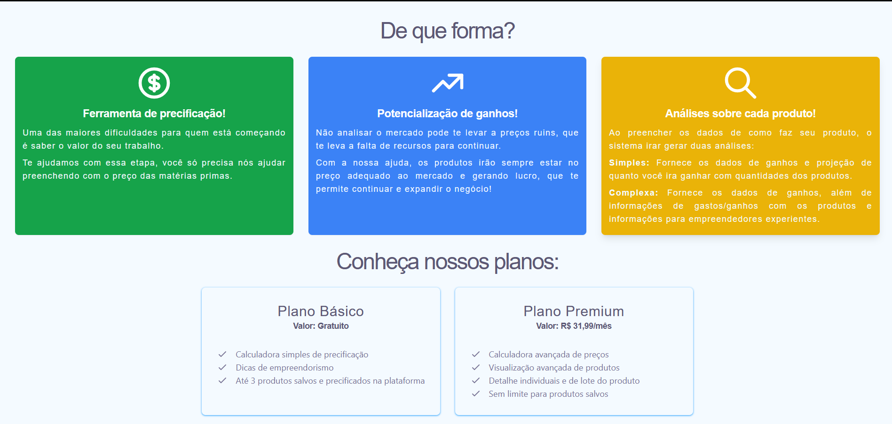
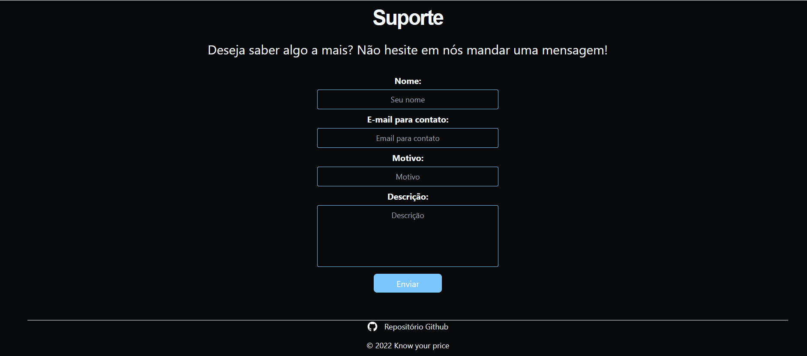
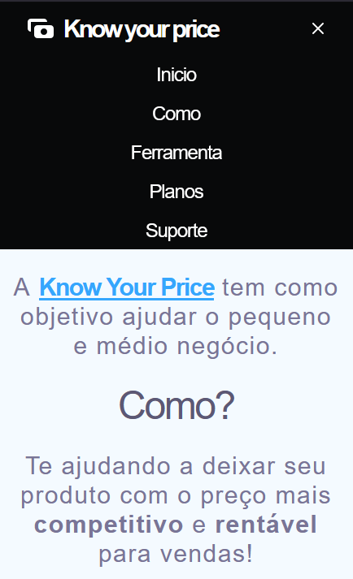

# Know your price in NextJS!

## 👀 Project Overview

- 😎 Um projeto que simula uma pequena landing page de uma startup fictícia que ajuda a precificar produtos;
- 👨‍💻 Usa NextJS mas poderia facilmente apenas usar React. Para a estilização utiliza TailwindCSS
- 🔗 Esse projeto pode ser encontrado rodando em: https://know-your-price.ribamarf01.dev
- 😜 A parte de suporte possui uma interação com a biblioteca EmailJS, se quiser, use para deixar uma mensagem para mim! :)

## 🔥 Techs used

<div style="
    display: inline-block
">
    
    
    
    
</div>

## 🔧 Build Setup

```bash
# install dependencies
$ npm install || yarn

# server with hot reload at localhost:3000
$ npm run dev || yarn dev

# build for production
$ npm run build || yarn build

# run the serverside app
$ npm run start || yarn start

```

## 📷 Project images






## 👽 External links

- 🔗 EmailJS Site: https://www.emailjs.com/
